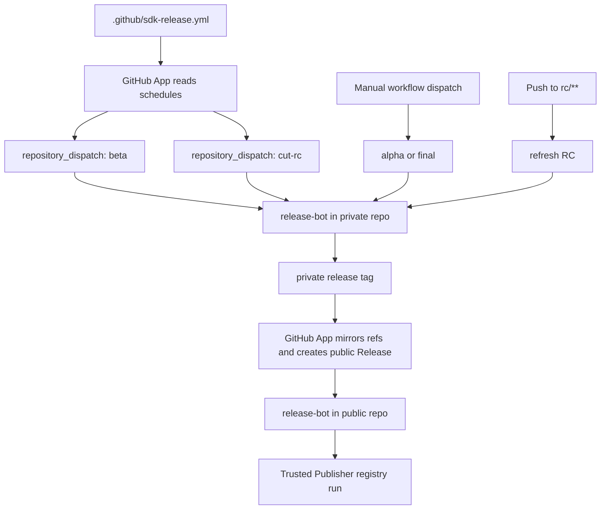

# SDK Release Action Simulation

This repository models the intended integration shape for a future
`sdk-release-action` plus a GitHub App control plane.

It uses two repositories:

- `loomb-oai/test-private-repo`
  - source of truth for daily development
  - runs release orchestration jobs
- `loomb-oai/test-public-repo`
  - exact Git mirror of the private repository
  - owns the public GitHub Release and Trusted Publisher registry run

The integrator-facing surface is now intentionally small:

- `.github/workflows/release-bot.yml`
  - the copy-paste workflow entrypoint
- `.github/sdk-release.yml`
  - repo-owned release policy, schedules, package definitions, and registry settings
- `.github/actions/sdk-release-sim`
  - a local stand-in for the future hosted action

## Control Plane

The GitHub App is the cross-repo control plane:

1. It reads `.github/sdk-release.yml` from the private repo default branch.
2. It schedules named jobs such as `nightly-beta` and `weekly-rc`.
3. When a schedule fires, it dispatches the private repo workflow with:

```json
{
  "event_type": "sdk-release",
  "client_payload": {
    "operation": "beta",
    "schedule-id": "nightly-beta"
  }
}
```

4. After a private release run creates its release tag, the App mirrors refs to
   the public repo and creates the public GitHub Release.
5. The public release event wakes the same `release-bot` workflow in the public
   mirror, where the action models npm and PyPI publication.

The sample repo models these boundaries and event shapes. It does not contain
the long-running GitHub App scheduler service itself.

## Lifecycle



## Repo-Owned Schedule Config

Schedules live in `.github/sdk-release.yml`, not in workflow cron syntax:

```yaml
schedules:
  nightly-beta:
    operation: beta
    cron: "0 18 * * *"
    timezone: America/Los_Angeles

  weekly-rc:
    operation: cut-rc
    cron: "1 0 * * 1"
    timezone: America/Los_Angeles
```

The App can refresh its schedule table on config-file pushes and reconcile it
periodically as a backstop.

## Release Channels

The sample models:

1. `alpha`
   - manual immediate validation from `main`
   - npm example: `0.2.0-alpha.20260515.1`
   - PyPI example: `0.2.0a2026051501`
2. `beta`
   - scheduled end-of-day build at 6:00 PM Pacific
   - npm example: `0.2.0-beta.20260515`
   - PyPI example: `0.2.0b20260515`
3. `rc`
   - scheduled Monday 00:01 Pacific branch cut into `rc/{version}`
   - refreshes when critical fixes land on `rc/**`
   - npm example: `0.2.0-rc.1`
   - PyPI example: `0.2.0rc1`
4. `production`
   - manual finalization from a selected RC branch
   - npm and PyPI example: `0.2.0`

## Trusted Publishing

The public mirror is the registry publish surface:

- npm is modeled as Trusted Publishers with GitHub Actions OIDC.
- PyPI is modeled as Trusted Publishing through
  `pypa/gh-action-pypi-publish@release/v1`.
- `packages/node-sdk/package.json` points its repository URL at
  `loomb-oai/test-public-repo`, which matches the npm publisher repository.
- The workflow carries `permissions.id-token: write` because the same mirrored
  workflow handles the public registry publish run.

## GitHub App Responsibilities

The App replaces any long-lived cross-repo token. It should:

- read `.github/sdk-release.yml`
- track schedules from the default branch
- dispatch `repository_dispatch` events into the private repo
- observe private release tags or equivalent release-ready signals
- mirror refs into the public repo
- create the public GitHub Release that triggers registry publishing

## How To Read The Demo

1. Start with `.github/sdk-release.yml`.
2. Read `.github/workflows/release-bot.yml`.
3. Follow `scripts/sdk-release-sim.mjs` to see how one workflow run resolves:
   - manual workflow dispatches
   - GitHub App `repository_dispatch` events
   - pushes to `rc/**`
   - public release events
4. Inspect `dist/release-manifest.json` after a local simulation to see the
   modeled npm/PyPI release output.

## What This Simulates

This is not a real package publisher. It is a visual model of the intended
contract:

- the GitHub App owns scheduling and cross-repo GitHub operations
- the workflow is a stable CI entrypoint
- the repo config owns release policy
- the action owns event routing, build orchestration, and registry execution
- the public repo remains an exact Git mirror of the private source repository
