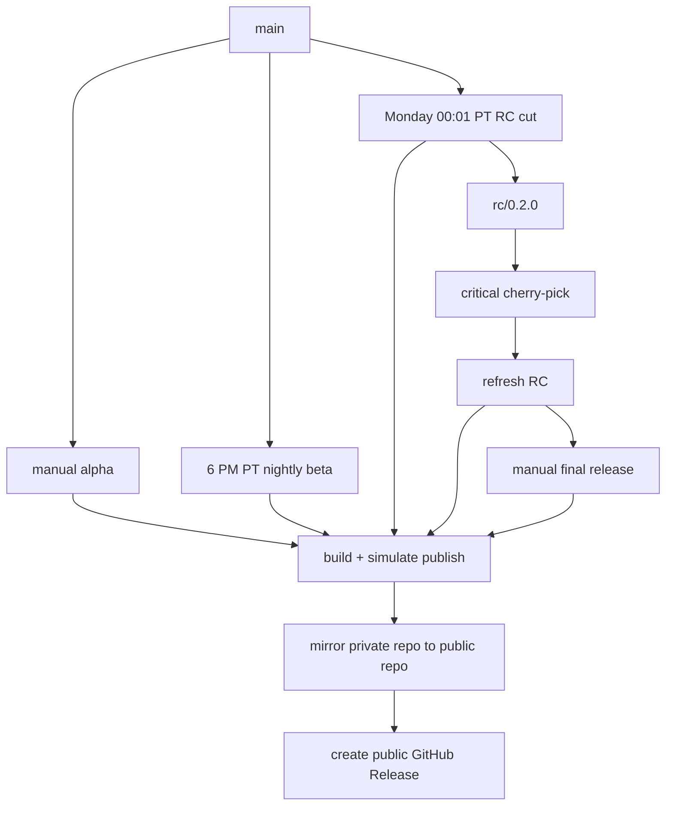

# SDK Release Action Simulation

This repository is a small monorepo that demonstrates the target integration
shape for a future `sdk-release-action`.

It intentionally models two repositories:

- `loomb-oai/test-private-repo`
  - source of truth for day-to-day development
  - owns the local release action and release workflows
- `loomb-oai/test-public-repo`
  - exact mirror of the private repository, including branches and tags
  - also hosts the public GitHub Release created by the publish workflow

The simulated release action lives at:

```text
.github/actions/sdk-release-sim
```

The repo keeps the original simple release PR demo, and now also models the
longer-term release train:

1. `Manual Alpha`
   - manually triggered for immediate validation from `main`
   - emits date-based alpha versions such as `0.2.0-alpha.20260515.1`
2. `Nightly Beta`
   - runs daily at 6:00 PM Pacific if there are changes since the last beta
   - emits date-based beta versions such as `0.2.0-beta.20260515`
3. `Weekly RC Cut`
   - runs every Monday at 00:01 Pacific
   - creates a durable `rc/{version}` branch, such as `rc/0.2.0`
   - emits `0.2.0-rc.1`
4. `Refresh RC`
   - runs whenever an `rc/**` branch changes
   - models critical cherry-picks during bake by emitting `0.2.0-rc.2`, etc.
5. `Final Release`
   - manually finalizes a chosen RC branch
   - emits the production version `0.2.0`

The earlier `Prepare Demo Release` / `Publish Merged Demo Release` workflows
remain as a minimal PR-oriented demonstration, but the release-train workflows
are the more realistic north star.

## Lifecycle



## Why a full mirror?

The sample uses a true **mirror** flow with `git push --mirror`.

That keeps `loomb-oai/test-public-repo` byte-for-byte aligned with
`loomb-oai/test-private-repo` at the Git ref level. GitHub's mirror guidance
uses the same model: a mirrored clone plus `git push --mirror`.

## Required Repository Setup

The private repository workflow expects:

- `PUBLIC_REPO_TOKEN`
  - a token that can push to `loomb-oai/test-public-repo`
  - it is also used to create GitHub Releases in the public repository

The workflow passes the private repo's default `GITHUB_TOKEN` back into the
action so it can perform an authenticated mirror clone of the private repo.

The public registry publishing job uses job-level
`permissions.id-token: write` because the intended registry model is Trusted
Publishing:

- npm Trusted Publishers with GitHub Actions OIDC
- PyPI Trusted Publishing through `pypa/gh-action-pypi-publish@release/v1`

The sample still simulates the actual registry upload, but the workflows and
config are shaped around the recommended production setup.

Because the public repository is the durable public surface, this sample models
trusted registry publishing from `loomb-oai/test-public-repo`, not from the
private source repository:

- private workflows cut channels, mirror refs to public, and create the public
  GitHub Release
- the mirrored `Public Registry Publish` workflow reacts to that public release
  event and models registry publication through the same local action in
  `registry-publish` mode
- that public publish job is the only place that asks GitHub for an OIDC token
- npm package metadata points at the public GitHub repository so the repository
  URL and Trusted Publisher repository configuration line up
- npm provenance remains available because the modeled publish surface is the
  public mirror rather than the private source repository
- private-only and public-only workflows are repository-guarded, which keeps an
  exact mirror from accidentally executing the wrong side of the pipeline

## Channel Versions

```text
alpha:      0.2.0-alpha.20260515.1
beta:       0.2.0-beta.20260515
rc:         0.2.0-rc.1
production: 0.2.0
```

PyPI-compatible versions are modeled separately:

```text
alpha:      0.2.0a2026051501
beta:       0.2.0b20260515
rc:         0.2.0rc1
production: 0.2.0
```

## How To Run The Demo

1. Open the private repo Actions tab.
2. Run `Manual Alpha` to model an immediate prerelease build.
3. Let `Nightly Beta` model the end-of-day snapshot.
4. Run `Weekly RC Cut` manually once if you do not want to wait for Monday.
5. Push or cherry-pick into `rc/0.2.0` to model a bake-week RC refresh.
6. Run `Final Release` with `rc/0.2.0`.
7. Inspect the public repo for:
   - the same source tree as the private repo
   - the same branches and tags as the private repo
   - prerelease and final GitHub Releases
   - the `Public Registry Publish` workflow kicked off by those releases

## What This Simulates

This is not a real package publisher. It is a visual model of the future
release action contract:

- the action owns release orchestration
- the integrator supplies package/build configuration
- the action performs release publication internally
- the public repo is an exact Git mirror of the private source repository
- alpha, beta, RC, and final production are explicit release channels
