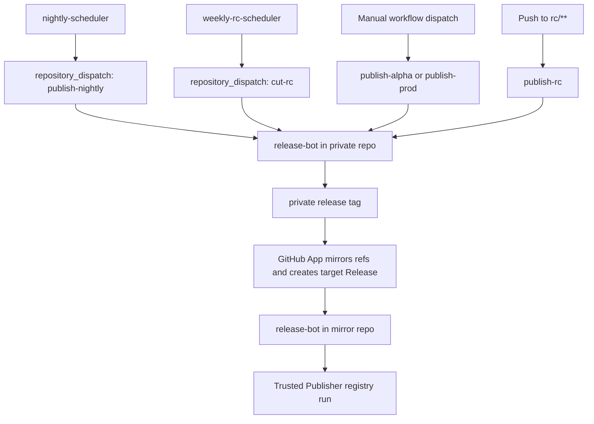

# SDK Release Action Simulation

This repository models the intended integration shape for a future
`sdk-release-action` plus a GitHub App control plane. The local action now
wraps Release Please instead of standing alone as a fake version oracle.

This sample uses two repositories:

- `loomb-oai/test-private-repo`
  - source of truth for daily development
  - runs release orchestration jobs
- `loomb-oai/test-public-repo`
  - exact Git mirror of the private repository
  - owns the mirrored GitHub Release and Trusted Publisher registry run

That topology is configurable. A single-repo integration can target the source
repo for both GitHub Releases and registry publishing instead.

The integrator-facing surface is now intentionally small:

- `.github/workflows/release-bot.yml`
  - the single copy-paste workflow entrypoint for orchestration and registry jobs
- `.github/workflows/nightly-scheduler.yml`
  - daily cron wrapper that dispatches `release-bot`
- `.github/workflows/weekly-rc-scheduler.yml`
  - Monday cron wrapper that dispatches `release-bot`
- `.github/sdk-release.yml`
  - repo-owned release policy, schedules, package definitions, and registry settings
- `.github/actions/sdk-release-action`
  - a local stand-in for the future hosted action
- `.github/release-please-config.json`
  - Release Please manifest-mode package configuration
- `.release-please-manifest.json`
  - Release Please released-version state for the sample packages

PyPI publishing stays as a top-level job in `release-bot.yml`. PyPI Trusted
Publishing does not currently support reusable workflows as the publishing
workflow identity, so this sample keeps orchestration, artifact handoff, and
the final PyPI publish job together in one workflow file.

## Control Plane

The near-term sample uses tiny scheduler workflows inside the private repo. For
the current end-to-end verification pass, they run on an intentionally faster
test cadence:

1. `nightly-scheduler.yml` targets the non-RC five-minute slots: `5, 10, 15, 25, 30, 35, 45, 50, 55`.
2. `weekly-rc-scheduler.yml` targets minute offsets `0, 20, 40`.
3. Each scheduler uses the workflow `GITHUB_TOKEN` to dispatch the same repo's
   `release-bot` workflow with:

```json
{
  "event_type": "sdk-release",
  "client_payload": {
    "operation": "publish-nightly",
    "schedule-id": "nightly"
  }
}
```

4. After a private release run creates its release tag, the App mirrors refs to
   the mirror repo and creates the mirror-side GitHub Release.
5. The mirrored release event wakes the same `release-bot` workflow in the
   target repo, where the action models npm and PyPI publication.

This keeps scheduling native to GitHub Actions. The GitHub App is the boundary
for the actual cross-repo work such as private-to-private mirroring in this
sample.

## Release Please

The local `sdk-release-action` wraps
`googleapis/release-please-action@v4` in manifest mode:

- it reads `.github/release-please-config.json`
- it reads `.release-please-manifest.json`
- it refreshes the private repo Release Please PR after normal pushes to
  `main`
- it also refreshes that plan before scheduled/manual release-train runs
- it sets `skip-github-release: true` because the mirror flow owns the target
  GitHub Release creation

The sample release train now treats Release Please as the candidate-version
authority:

- when Release Please refreshes a release PR, the local action reads that PR
  head's `.release-please-manifest.json`
- alpha, nightly, and RC versions are derived from the candidate version found in
  that Release Please-managed manifest
- weekly RC cuts fork the RC branch from that same Release Please candidate
  commit, preserving the exact stable-version/changelog state Release Please
  authored for that train
- RC and final publish jobs apply prerelease or final packaging overlays only in
  the CI workspace; they do not rewrite the RC branch's Release Please-authored
  stable files
- local/offline simulations fall back to the checked-in manifest when no PR
  metadata is available

That means the action no longer invents `0.2.0` by applying a local "always bump
minor" rule. Release Please decides the base version; `sdk-release-action`
only decorates it for the selected channel.

## Lifecycle



## Repo-Owned Schedule Config

The release policy still names the schedules in `.github/sdk-release.yml`:

```yaml
schedules:
  nightly:
    operation: publish-nightly
    cron: "0 18 * * *"
    timezone: America/Los_Angeles

  weekly-rc:
    operation: cut-rc
    cron: "1 0 * * 1"
    timezone: America/Los_Angeles
```

The two scheduler workflows carry the actual GitHub cron expressions today and
send the matching `schedule-id` into `release-bot`.

## Release Channels

The sample models:

1. `publish-alpha`
   - manual immediate validation from `main`
   - npm example: `0.2.0-alpha.20260515.1`
   - PyPI example: `0.2.0a2026051501`
2. `publish-nightly`
   - temporary verification cadence targeting every 5-minute slot except the RC minutes
   - npm example: `0.2.0-dev.20260515.1801`
   - PyPI example: `0.2.0.dev202605151801`
3. `cut-rc` and `publish-rc`
   - temporary verification cadence targeting branch cuts every 20 minutes into `rc/{version}`
   - scheduled cuts no-op when the existing RC branch already matches the current Release Please candidate commit
   - branch contents are snapped from the Release Please candidate commit
   - refreshes when critical fixes land on `rc/**`
   - npm example: `0.2.0-rc.1`
   - PyPI example: `0.2.0rc1`
4. `publish-prod`
   - manual finalization from a selected RC branch
   - promotes the preserved Release Please candidate state on that RC branch
   - npm and PyPI example: `0.2.0`

Those examples assume Release Please's current candidate version is `0.2.0`.

## Trusted Publishing

This sample chooses the mirror repo as the registry publish surface:

- npm publishes through Trusted Publishers with GitHub Actions OIDC.
- PyPI publishes through Trusted Publishing via
  `pypa/gh-action-pypi-publish@release/v1`.
- `packages/node-sdk/package.json` points its repository URL at
  `loomb-oai/test-public-repo`, which matches the configured publish-surface
  repository for this sample.
- The workflow carries `permissions.id-token: write` because the same mirrored
  workflow handles the registry publish run.

Before running this in `mode: publish`, configure each registry to trust the
mirror-side release job:

- npm Trusted Publisher: repository `loomb-oai/test-public-repo`, workflow
  `release-bot.yml`, and the matching package ownership/settings on npm.
- PyPI Trusted Publisher: repository `loomb-oai/test-public-repo`, workflow
  `release-bot.yml`, environment `main`, and the matching project or pending
  publisher configuration on PyPI.

For this private-to-private proof of concept, the mirror repo can stay private.
If this exact topology is later used to obtain npm provenance attestations, the
actual npm publish surface would need to be a public GitHub repository.

The repo config makes that explicit:

```yaml
repository:
  source: loomb-oai/test-private-repo
  mirror:
    enabled: true
    target: loomb-oai/test-public-repo

releases:
  github:
    target: mirror

publishing:
  mode: publish
  surface: mirror
```

A single-repo setup would instead use:

```yaml
repository:
  source: some-org/sdk-repo
  mirror:
    enabled: false

releases:
  github:
    target: source

publishing:
  mode: publish
  surface: source
```

## GitHub App Responsibilities

The App replaces any long-lived cross-repo token. It should:

- observe private release tags or equivalent release-ready signals
- mirror refs into the target repo
- create the target GitHub Release that triggers registry publishing

The sample workflow passes these CI secrets into the local action when
mirror-targeted release behavior is configured:

- `SDK_RELEASE_GH_APP_ID`
- `SDK_RELEASE_GH_APP_PRIVATE_KEY`

The GitHub App needs to be installed on both repositories. Its repository
permissions should include:

- `Contents: Read and write` so the action can push mirrored refs and create Releases
- `Pull requests: Read and write` so Release Please can create or update release PRs
- `Issues: Read and write` for the Release Please issue/comment surfaces it may use
- `Workflows: Read and write` so mirrored pushes can update `.github/workflows/*`

The local action now mints an installation token with
`actions/create-github-app-token@v3`, then:

- gives Release Please a token that can create/update the release PR even when
  repository policy blocks `GITHUB_TOKEN` from creating pull requests
- pushes the selected source branch into the mirror repo
- pushes the release tag into the mirror repo
- creates the mirror-side GitHub Release if it does not already exist

That target release is what triggers the mirrored repo's `release.published`
workflow path.

The action also emits `dist/mirror-propagation.json` as a debug artifact. It
contains:

- source repo
- configured Release target repo
- configured publishing surface
- whether the App credentials and minted token were present
- tag and release metadata
- artifact paths to attach

## How To Read The Demo

1. Start with `.github/sdk-release.yml`.
2. Read the two scheduler workflows.
3. Read `.github/workflows/release-bot.yml`.
4. Follow `scripts/sdk-release-action.mjs` to see how one workflow run resolves:
   - manual workflow dispatches
   - scheduler `repository_dispatch` events
   - pushes to `rc/**`
   - mirrored release events
5. Inspect `dist/release-manifest.json` after a run to see the npm/PyPI release
   payload that drives publish steps.
6. Inspect `dist/mirror-propagation.json` to see the exact mirrored branch,
   tag, and target-release payload.

## What This Demonstrates

With `publishing.mode: publish`, the mirrored release workflow now performs
real npm and PyPI publish steps once the corresponding registry Trusted
Publishers are configured. The sample still keeps the packages intentionally
small so the release contract is easy to inspect:

- scheduler workflows own the recurring wake-ups and same-repo dispatch
- the GitHub App owns cross-repo GitHub operations
- the workflow is a stable CI entrypoint
- the repo config owns release policy
- Release Please owns release-plan maintenance from Conventional Commits
- the action owns event routing, build orchestration, and npm registry execution
- the workflow owns the caller-level PyPI Trusted Publishing job
- the mirror repo remains an exact Git mirror of the private source repository
