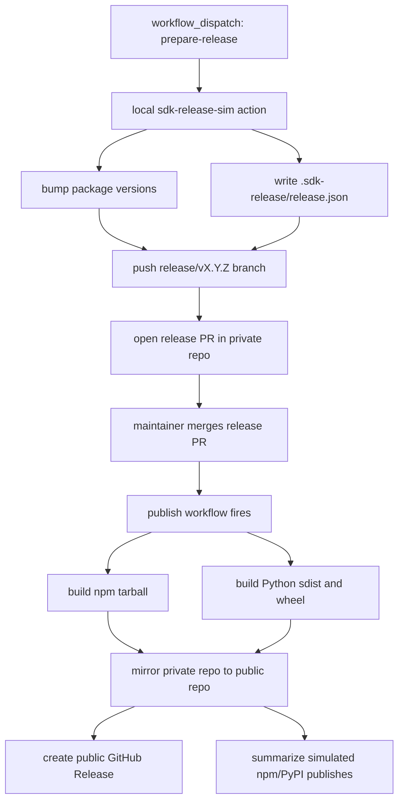

# SDK Release Action Simulation

This repository is a small monorepo that demonstrates the target integration
shape for a future `sdk-release-action`.

It intentionally models two repositories:

- `loomb-oai/test-private-repo`
  - source of truth for day-to-day development
  - owns the local release action and release workflows
- `loomb-oai/test-public-repo`
  - exact mirror of the private repository, including branches and tags
  - also hosts the public GitHub Release created by the publish workflow

The simulated release action lives at:

```text
.github/actions/sdk-release-sim
```

The repo uses two workflows:

1. `Prepare Demo Release`
   - launched manually with a version like `0.2.0`
   - updates package versions, writes release metadata, and opens a release PR
2. `Publish Merged Demo Release`
   - runs when that release PR is merged
   - builds npm and PyPI artifacts
   - mirror-pushes the private repository to the public repository
   - creates a public GitHub Release with the artifacts attached
   - writes simulated npm/PyPI registry records into the workflow summary

## Lifecycle



## Why a full mirror?

The sample uses a true **mirror** flow with `git push --mirror`.

That keeps `loomb-oai/test-public-repo` byte-for-byte aligned with
`loomb-oai/test-private-repo` at the Git ref level. GitHub's mirror guidance
uses the same model: a mirrored clone plus `git push --mirror`.

## Required Repository Setup

The private repository workflow expects:

- `PUBLIC_REPO_TOKEN`
  - a token that can push to `loomb-oai/test-public-repo`
  - it is also used to create GitHub Releases in the public repository

The workflow passes the private repo's default `GITHUB_TOKEN` back into the
action so it can perform an authenticated mirror clone of the private repo.

## How To Run The Demo

1. Open the private repo Actions tab.
2. Run `Prepare Demo Release`.
3. Enter a version such as `0.2.0`.
4. Review and merge the generated release PR.
5. Watch `Publish Merged Demo Release`.
6. Inspect the public repo for:
   - the same source tree as the private repo
   - the same branches and tags as the private repo
   - a GitHub Release tagged `v0.2.0`

## What This Simulates

This is not a real package publisher. It is a visual model of the future
release action contract:

- the action owns release orchestration
- the integrator supplies package/build configuration
- the action performs release publication internally
- the public repo is an exact Git mirror of the private source repository
